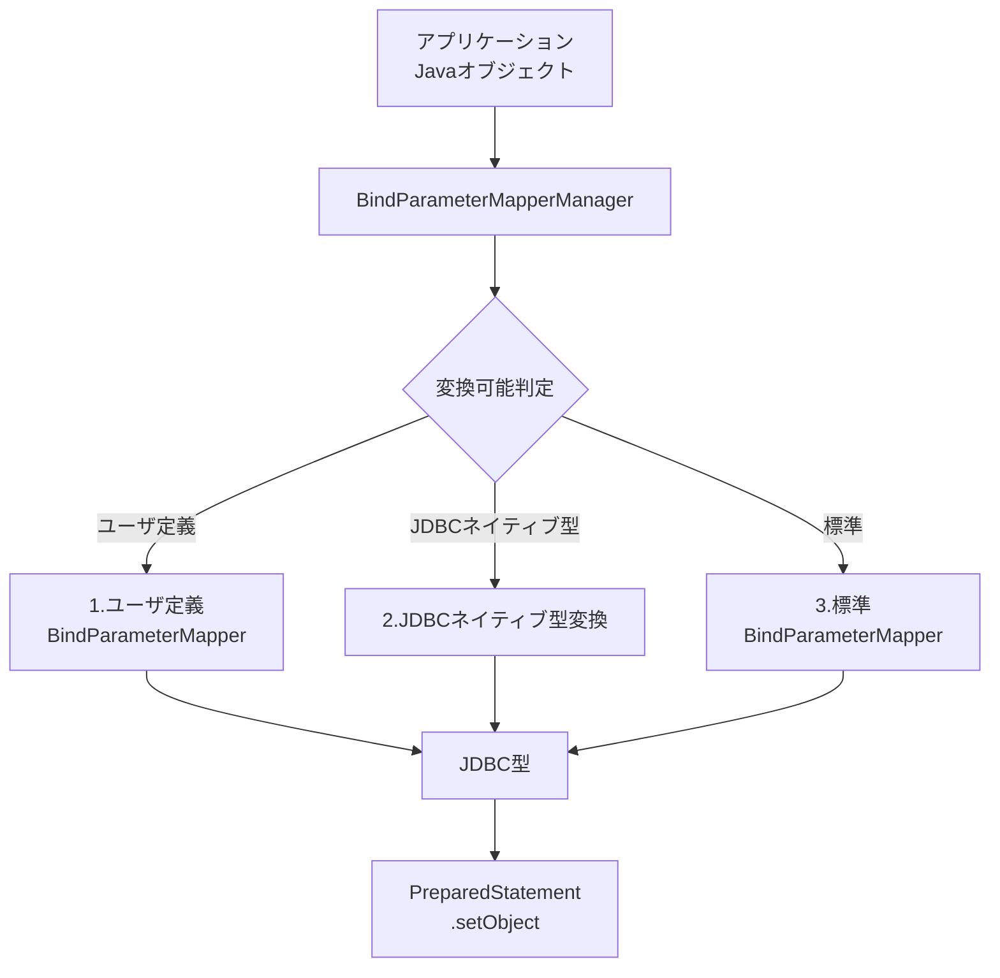
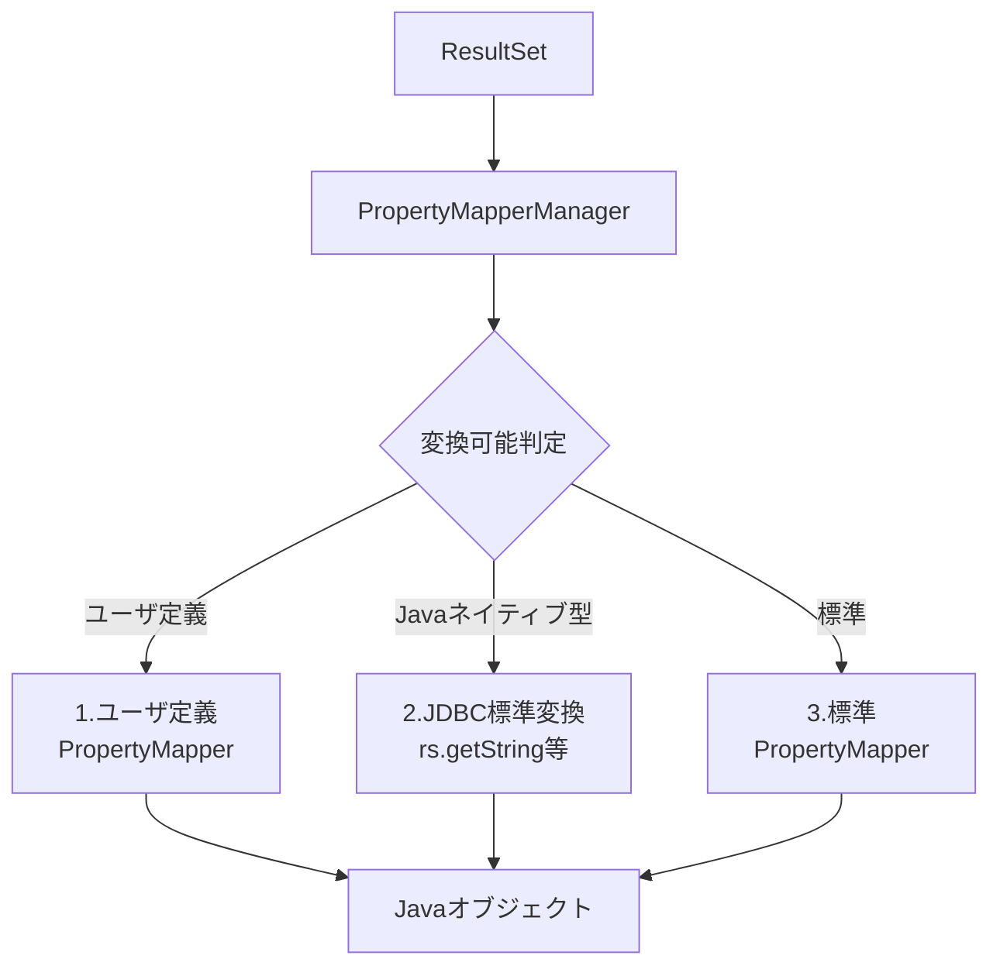

# JavaオブジェクトとJDBC型のパラメータマッピング

**uroboroSQL**では、JavaオブジェクトとJDBC間の型変換を自動的に行う仕組みを提供しています。\
この機能により、アプリケーション層で使用する型（Java 8 Date and Time API、Optional、Enum、カスタムドメインオブジェクトなど）とデータベース層で使用する型（java.sql.\*クラス、プリミティブ型など）を相互に変換できます。

マッピングは2つの方向で行われます：

1. **Javaオブジェクト → JDBC型の変換**: バインドパラメータ設定時に`BindParameterMapper`が使用されます
2. **JDBC型 → Javaオブジェクトの変換**: ResultSet取得時に`PropertyMapper`が使用されます

## 1. Javaオブジェクト → JDBCオブジェクトの変換（BindParameterMapper）

バインドパラメータを設定する際、`BindParameterMapperManager`が適切な`BindParameterMapper`を選択し、JavaオブジェクトをJDBCが受け入れ可能な型に変換します。



### BindParameterMapperの選択順序

1. ユーザ定義Mapper
   1. ServiceLoaderで登録されたユーザ定義Mapper
   2. BindParameterMapperManager#addMapperで追加されたユーザ定義Mapper
2. Javaプリミティブ型とラッパークラス他
   1. short, int, long, double, boolean, byte とそのラッパークラス
   2. String, BigDecimal, byte\[]
   3. java.sql.\*型
3. 標準Mapper
   1. DateTimeApiParameterMapper
   2. その他の標準Mapper（Date, BigInteger, Optional, Domain, Enum, 配列型）
4. 変換なし

::: tip Mapperの優先度制御
ユーザ定義Mapperは標準Mapperより優先されるため、標準の変換動作をオーバーライドすることができます。\
複数のMapperが同じ型を処理できる場合、最初にマッチしたMapperが使用されます。
:::

### 主要インターフェース

```java
public interface BindParameterMapper<T> {
    // 変換対象の型を返す
    Class<T> targetType();

    // 変換可能かどうかを判定
    boolean canAccept(Object object);

    // JDBCが受け入れ可能な型に変換
    Object toJdbc(T original, Connection connection, BindParameterMapperManager parameterMapperManager);
}
```

### 標準で提供されるMapper

**uroboroSQL**は以下の`BindParameterMapper`を標準で提供しています。

| Mapper名                              | 標準Mapper登録 | 対象Java型                                 | 変換後JDBC型          | 説明                                                 |
| ------------------------------------- | :------------: | ------------------------------------------ | --------------------- | ---------------------------------------------------- |
| **DateParameterMapper**               |       〇       | java.util.Date                             | java.sql.Timestamp    | java.util.DateをTimestampに変換                      |
| **BigIntegerParameterMapper**         |       〇       | BigInteger                                 | BigDecimal            | BigIntegerをBigDecimalに変換                         |
| **DateTimeApiParameterMapper**        |       〇       | TemporalAccessor（各種）                   | Timestamp/Date/Time   | Java 8 Date and Time APIの各型をSQL型に変換          |
| **OptionalParameterMapper**           |       〇       | Optional\<T>                              | Tの変換結果またはnull | Optionalの値を取り出して変換                         |
| **OptionalIntParameterMapper**        |       〇       | OptionalInt                                | Integer/null          | OptionalIntの値を抽出                                |
| **OptionalLongParameterMapper**       |       〇       | OptionalLong                               | Long/null             | OptionalLongの値を抽出                               |
| **OptionalDoubleParameterMapper**     |       〇       | OptionalDouble                             | Double/null           | OptionalDoubleの値を抽出                             |
| **DomainParameterMapper**             |       〇       | @Domain付きクラス                          | ドメインの値型        | ドメインオブジェクトから値を抽出                     |
| **EnumParameterMapper**               |       〇       | Enum                                       | String                | Enum値をtoString()メソッドで文字列に変換             |
| **StringArrayParameterMapper**        |       〇       | String\[]                                   | java.sql.Array        | String配列をSQL Arrayに変換                          |
| **IntArrayParameterMapper**           |       〇       | int\[]                                      | java.sql.Array        | int配列をSQL Arrayに変換                             |
| **IntWrapperArrayParameterMapper**    |       〇       | Integer\[]                                  | java.sql.Array        | Integer配列をSQL Arrayに変換                         |
| **LongArrayParameterMapper**          |       〇       | long\[]                                     | java.sql.Array        | long配列をSQL Arrayに変換                            |
| **LongWrapperArrayParameterMapper**   |       〇       | Long\[]                                     | java.sql.Array        | Long配列をSQL Arrayに変換                            |
| **DoubleArrayParameterMapper**        |       〇       | double\[]                                   | java.sql.Array        | double配列をSQL Arrayに変換                          |
| **DoubleWrapperArrayParameterMapper** |       〇       | Double\[]                                   | java.sql.Array        | Double配列をSQL Arrayに変換                          |
| **EmptyStringToNullParameterMapper**  |                | String                                     | String/null           | 空文字列をnullに変換                                 |
| **DateToStringParameterMapper**       |                | java.util.Date                             | String                | yyyyMMdd形式の文字列に変換                           |
| **LocalDateToStringParameterMapper**  |                | java.time.LocalDate                        | String                | yyyyMMdd形式の文字列に変換                           |
| **TimeToStringParameterMapper**       |                | LocalTime/OffsetTime                       | String                | HHmmss形式の文字列に変換                             |
| **DateTimeToStringParameterMapper**   |                | LocalDateTime/OffsetDateTime/ZonedDateTime | String                | yyyyMMddHHmmssSSS形式の文字列に変換                  |
| **SqlTimeToStringParameterMapper**    |                | java.sql.Time                              | String                | HHmmss形式の文字列に変換                             |
| **YearToStringParameterMapper**       |                | java.time.Year                             | String                | yyyy形式の文字列に変換                               |
| **YearMonthToStringParameterMapper**  |                | java.time.YearMonth                        | String                | yyyyMM形式の文字列に変換                             |
| **MonthDayToStringParameterMapper**   |                | java.time.MonthDay                         | String                | MMdd形式の文字列に変換                               |
| **MonthToStringParameterMapper**      |                | java.time.Month                            | String                | MM形式（01〜12）の文字列に変換                       |
| **DayOfWeekToStringParameterMapper**  |                | java.time.DayOfWeek                        | String                | 数字形式（1（月曜日）から7（日曜日））の文字列に変換 |

## 2. JDBC型 → Javaオブジェクトの変換（PropertyMapper）

ResultSetから値を取得する際、`PropertyMapperManager`が適切な`PropertyMapper`を選択し、JDBC型をアプリケーションで使用するJavaオブジェクトに変換します。



### PropertyMapperの選択順序

1. ユーザ定義Mapper
   1. ServiceLoaderで登録されたユーザ定義Mapper
   2. PropertyMapperManager#addMapperで登録されたユーザ定義Mapper
2. Javaプリミティブ型とラッパークラス他
   1. short, int, long, double, boolean, byte とそのラッパークラス
   2. String, BigDecimal, byte\[]
   3. java.sql.\*型
3. 標準Mapper
   1. DateTimeApiParameterMapper
   2. その他の標準Mapper（BigInteger, Optional, Domain, Enum, 配列型）

::: tip Mapperの優先度制御
ユーザ定義Mapperは標準Mapperより優先されるため、標準の変換動作をオーバーライドすることができます。\
複数のMapperが同じ型を処理できる場合、最初にマッチしたMapperが使用されます。
:::

### 主要インターフェース

```java
public interface PropertyMapper<T> {
    // 変換可能な型かどうかを判定
    boolean canAccept(Class<?> type);

    // ResultSetから値を取得して型変換
    T getValue(JavaType type, ResultSet rs, int columnIndex, PropertyMapperManager mapperManager) throws SQLException;
}
```

### 標準で提供されるMapper

**uroboroSQL**は以下の`PropertyMapper`を標準で提供しています。

| Mapper名                         | 標準Mapper登録 | 変換元JDBC型               | 対象Java型               | 説明                                            |
| -------------------------------- | :------------: | -------------------------- | ------------------------ | ----------------------------------------------- |
| **BigIntegerPropertyMapper**     |       〇       | BigDecimal/Long等          | BigInteger               | 数値型をBigIntegerに変換                        |
| **DateTimeApiPropertyMapper**    |       〇       | Timestamp/Date/Time/String | TemporalAccessor（各種） | SQL型やString型をJava 8 Date and Time APIに変換 |
| **OptionalPropertyMapper**       |       〇       | 任意                       | Optional\<T>            | Optional型に変換                                |
| **OptionalIntPropertyMapper**    |       〇       | Integer/null               | OptionalInt              | OptionalInt型に変換                             |
| **OptionalLongPropertyMapper**   |       〇       | Long/null                  | OptionalLong             | OptionalLong型に変換                            |
| **OptionalDoublePropertyMapper** |       〇       | Double/null                | OptionalDouble           | OptionalDouble型に変換                          |
| **DomainPropertyMapper**         |       〇       | ドメインの値型             | @Domain付きクラス        | 値からドメインオブジェクトを生成                |
| **EnumPropertyMapper**           |       〇       | String/Integer             | Enum                     | 文字列または数値からEnum値に変換                |
| **ArrayPropertyMapper**          |       〇       | java.sql.Array             | 配列型                   | SQL ArrayをJava配列に変換                       |

## 主要Mapperの詳細

### DateTimeApiParameterMapper / DateTimeApiPropertyMapper

Java 8 Date and Time APIの各型とSQL型の相互変換を行います。

* **Java → JDBC変換（DateTimeApiParameterMapper）**

| Java型                               | 変換後のJDBC型        |
| ------------------------------------ | --------------------- |
| LocalDate                            | java.sql.Date         |
| LocalTime                            | java.sql.Time         |
| OffsetTime                           | java.sql.Time         |
| LocalDateTime                        | java.sql.Timestamp    |
| OffsetDateTime                       | java.sql.Timestamp    |
| ZonedDateTime                        | java.sql.Timestamp    |
| Instant                              | java.sql.Timestamp    |
| Year                                 | String または Integer |
| YearMonth                            | String または Integer |
| MonthDay                             | String または Integer |
| Month                                | String または Integer |
| DayOfWeek                            | String または Integer |
| Era                                  | String または Integer |
| ChronoLocalDate （JapaneseDateなど） | java.sql.Date         |

* **JDBC → Java変換（DateTimeApiPropertyMapper）**

変換元JDBC型のカラム値から指定されたJava型に合わせた型変換を行います。

| 変換元JDBC型                                                    |
| --------------------------------------------------------------- |
| java.sql.Date                                                   |
| java.sql.Time                                                   |
| java.sql.Timestamp                                              |
| String（[変換可能日時フォーマット](#変換可能日時フォーマット)） |

| 変換可能Java型                       |
| ------------------------------------ |
| LocalDate                            |
| LocalTime                            |
| OffsetTime                           |
| LocalDateTime                        |
| OffsetDateTime                       |
| ZonedDateTime                        |
| Year                                 |
| YearMonth                            |
| MonthDay                             |
| Month                                |
| DayOfWeek                            |
| Era                                  |
| ChronoLocalDate （JapaneseDateなど） |

#### 変換可能日時フォーマット

| Java型                                     | 受け入れ可能なStringフォーマット                           | 例                                            |
| ------------------------------------------ | ---------------------------------------------------------- | --------------------------------------------- |
| LocalDate                                  | yyyyMMdd / yyyy-MM-dd                                      | 20250131 / 2025-01-31                         |
| LocalTime                                  | HH:mm / HH:mm:ss / HH:mm:ss.S…（小数1〜9桁）               | 12:34 / 12:34:56 / 12:34:56.789               |
|                                            | HHmm / HHmmss / HHmmssS…（小数1〜9桁, 区切りなし）         | 1234 / 123456 / 123456789                     |
| LocalDateTime/OffsetDateTime/ZonedDateTime | yyyy-MM-dd'T'HH:mm:ss / yyyy-MM-dd'T'HH:mm:ss.S…（1〜9桁） | 2025-01-31T12:34:56 / 2025-01-31T12:34:56.789 |
|                                            | yyyyMMddHHmmss                                             | 20250131123456                                |
|                                            | yyyyMMddHHmmssSSS（ミリ秒）                                | 20250131123456789                             |
|                                            | yyyyMMddHHmmssSSSSSS（マイクロ秒）                         | 20250131123456789012                          |
|                                            | yyyyMMddHHmmssSSSSSSSSS（ナノ秒）                          | 20250131123456789012345                       |
| Year                                       | 数値文字列（yyyy）                                         | 2025                                          |
| YearMonth                                  | 数値文字列（yyyyMM）                                       | 202501                                        |
| MonthDay                                   | 数値文字列（MMdd）                                         | 0131                                          |
| Month                                      | 数値文字列（1〜12）                                        | 1 / 12                                        |
| DayOfWeek                                  | 数値文字列（1〜7）                                         | 1（月）〜7（日）                              |
| Era                                        | 数値文字列（実装依存のコード）                             | 例：日本暦のJapaneseEra.of(1) = SHOWA など    |

#### 使用例

```java
// 検索結果格納用Beanクラス
public class ResultBean {
    private LocalDateTime eventDate;  // 検索結果の Timestampカラムの値がLocalDateTimeに変換されて設定
    // ...
}
List<ResultBean> results = agent.query("example/select_by_date")
    .param("targetDate", LocalDateTime.now()) // LocalDateTimeをバインドパラメータとして使用
    .collect(ResultBean.class);

```

### ToStringParameterMapper

古いシステムでは、日付型や日時型の値を `20250131`（`yyyyMMdd`形式）や `20250131123456`（`yyyyMMddHHmmss`形式）といった文字列として格納することがあります。\
このようなケースに対応するため **uroboroSQL** では日付型や日時型のバインドパラメータを文字列に変換するBindParameterMapperを標準で提供しています。

`ToStringParameterMapper` には以下の種類があります。

| Mapper名                             | 対象Java型                                 | 説明                                                 |
| ------------------------------------ | ------------------------------------------ | ---------------------------------------------------- |
| **DateToStringParameterMapper**      | java.util.Date                             | yyyyMMdd形式の文字列に変換                           |
| **LocalDateToStringParameterMapper** | java.time.LocalDate                        | yyyyMMdd形式の文字列に変換                           |
| **TimeToStringParameterMapper**      | LocalTime/OffsetTime                       | HHmmss形式の文字列に変換                             |
| **DateTimeToStringParameterMapper**  | LocalDateTime/OffsetDateTime/ZonedDateTime | yyyyMMddHHmmssSSS形式の文字列に変換                  |
| **SqlTimeToStringParameterMapper**   | java.sql.Time                              | HHmmss形式の文字列に変換                             |
| **YearToStringParameterMapper**      | java.time.Year                             | yyyy形式の文字列に変換                               |
| **YearMonthToStringParameterMapper** | java.time.YearMonth                        | yyyyMM形式の文字列に変換                             |
| **MonthDayToStringParameterMapper**  | java.time.MonthDay                         | MMdd形式の文字列に変換                               |
| **MonthToStringParameterMapper**     | java.time.Month                            | MM形式（01〜12）の文字列に変換                       |
| **DayOfWeekToStringParameterMapper** | java.time.DayOfWeek                        | 数字形式（1（月曜日）から7（日曜日））の文字列に変換 |

`ToStringParameterMapper` を有効にする場合、後述する[ユーザ定義Mapperの登録](#ユーザ定義mapperの登録) で `ToStringParameterMapper` の登録を行ってください。

::: tip
**JDBC → Java変換** では `DateTimeApiPropertyMapper` が 文字列型から日付型や日時型への変換に対応しているため、ユーザ定義PropertyMapperの登録は不要です
:::

### EmptyStringToNullParameterMapper

データベースによって `NULL` と `空文字（""）` の扱いが異なります。

* **`NULL` と `空文字` を区別する** ： PostgreSQL、MySQL、SQL Server
* **`空文字` を `NULL` として扱う** ： Oracle

`EmptyStringToNullParameterMapper` を使用するとバインドパラメータとして空文字列が設定された際、それを自動的に `NULL` に変換することができます。
これにより、データベース間の差異を吸収し、一貫した動作を実現できます。

#### 使用例

```java
// EmptyStringToNullParameterMapperを登録
config.getExecutionContextProvider()
  .addBindParameterMapper(new EmptyStringToNullParameterMapper());

// 空文字列がnullに変換される
agent.update("user/update_user")
  .param("middleName", "")  // 内部的にnullとしてバインドされる
  .count();
```

::: warning 注意
`EmptyStringToNullParameterMapper` は標準では登録されていません。必要に応じて[ユーザ定義Mapperの登録](#ユーザ定義mapperの登録)で登録してください。
:::

### EnumParameterMapper / EnumPropertyMapper

Enum型とデータベース値の相互変換を行います。

#### 使用例

```java
public enum Status {
    ACTIVE("01"), INACTIVE("02"), DELETED("03");

    private final String code;

    private Status(String code) {
      this.code = code;
    }

    @Override
    public String toString() {
      return code;
    }
}

// 検索結果を格納するBean
public class User {
    private Status status;  // "01"という文字列をStatus#toString()と比較し、一致するStatus.ACTIVEに変換される
    // ...
}

// バインドパラメータとして使用
List<User> users = agent.query("user/select_by_status")
    .param("status", Status.ACTIVE)  // "01"という文字列としてバインドされる
    .collect(User.class);
```

### DomainParameterMapper / DomainPropertyMapper

`@Domain`アノテーションが付いたドメインオブジェクトの変換を行います。
::: tip
@Domain アノテーションの記述方法については [Entityアノテーション > @Domain](../basics/entity-api.md#domain) を参照してください。
:::

#### 使用例

```java
// ドメインオブジェクトの定義
@Domain(valueType = String.class)
public class UserId {
    private final String value;

    public UserId(String value) {
        this.value = value;
    }

    public String getValue() {
        return value;
    }
}

// 検索結果を格納するBean
public class User {
    private UserId userId;  // VARCHAR値がUserIdオブジェクトに変換される
    // ...
}

// バインドパラメータとして使用
List<User> users = agent.query("user/select_by_user_id")
    .param("userId", new UserId("USER001"))  // 内部的に"USER001"がバインドされる
    .collect(User.class);
```

### OptionalParameterMapper / OptionalIntParameterMapper / OptionalLongParameterMapper / OptionalDoubleParameterMapper / OptionalPropertyMapper / OptionalIntPropertyMapper / OptionalLongPropertyMapper / OptionalDoublePropertyMapper

`Optional`型 / `OptionalInt`型 / `OptionalLong`型 / `OptionalDouble`型 とnull値の相互変換を行います。

#### 使用例

```java
// 検索結果を格納するBean
public class User {
    private Optional<String> middleName;  // NULLならOptional.empty()、値があればOptional.of(値)
    // ...
}

List<User> users = null;

// バインドパラメータとして使用
Optional<String> optionalName = Optional.of("John");
users = agent.query("user/select_by_name")
    .param("name", optionalName)  // "John"がバインドされる
    .collect(User.class);

Optional<String> emptyName = Optional.empty();
users = agent.query("user/select_by_name")
    .param("name", emptyName)  // nullがバインドされる
    .collect(User.class);
```

## ユーザ定義Mapperの作成

以下のように独自の型を作成し、この型に対して独自の型変換が必要な場合、ユーザ定義Mapperを作成することができます。

```java
// 電話番号型
public class PhoneNumber {
    private String countryCode;
    private String number;

    public String toFullNumber() {
        return countryCode + "-" + number;
    }
}
```

### ユーザ定義BindParameterMapperの作成

```java
// ユーザ定義BindParameterMapper
public class PhoneNumberParameterMapper implements BindParameterMapper<PhoneNumber> {

    @Override
    public Class<PhoneNumber> targetType() {
        return PhoneNumber.class;
    }

    @Override
    public Object toJdbc(PhoneNumber original, Connection connection, BindParameterMapperManager parameterMapperManager) {
        if (original == null) {
            return null;
        }
        return original.toFullNumber();  // 文字列に変換
    }
}
```

### ユーザ定義PropertyMapperの作成

```java
// ユーザ定義PropertyMapper
public class PhoneNumberPropertyMapper implements PropertyMapper<PhoneNumber> {
    @Override
    public boolean canAccept(Class<?> type) {
        return PhoneNumber.class.equals(type);
    }

    @Override
    public PhoneNumber getValue(JavaType type, ResultSet rs, int columnIndex, PropertyMapperManager mapperManager) throws SQLException {
        String fullNumber = rs.getString(columnIndex);
        if (fullNumber == null) {
            return null;
        }
        // 文字列をパースしてPhoneNumberオブジェクトを生成
        String[] parts = fullNumber.split("-");
        return new PhoneNumber(parts[0], parts[1]);
    }
}
```

## ユーザ定義Mapperの登録

ユーザ定義Mapperの登録は、以下のいずれかの方法で行います。

### 1. ServiceLoaderを使用した自動登録

`META-INF/services`ディレクトリに以下のファイルを作成することで、自動的にMapperが登録されます。

**BindParameterMapperの登録**

ファイル名: `META-INF/services/jp.co.future.uroborosql.parameter.mapper.BindParameterMapper`

```
com.example.mapper.PhoneNumberParameterMapper
```

**PropertyMapperの登録**

ファイル名: `META-INF/services/jp.co.future.uroborosql.mapping.mapper.PropertyMapper`

```
com.example.mapper.PhoneNumberPropertyMapper
```

### 2. SqlConfig生成時に登録

```java
SqlConfig config = UroboroSQL.builder("jdbc:h2:mem:test", "sa", "")
    .build();

// BindParameterMapperの登録
config.getExecutionContextProvider()
    .addBindParameterMapper(new PhoneNumberParameterMapper());

// PropertyMapperの登録
config.getEntityHandler()
    .addPropertyMapper(new PhoneNumberPropertyMapper());
```
