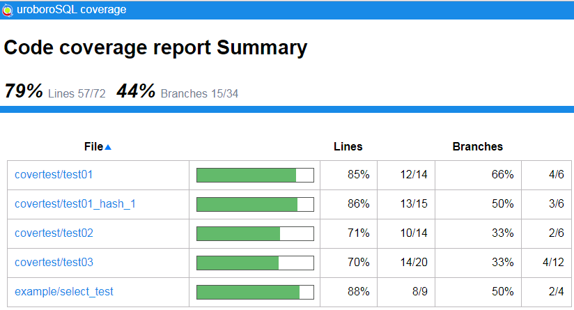
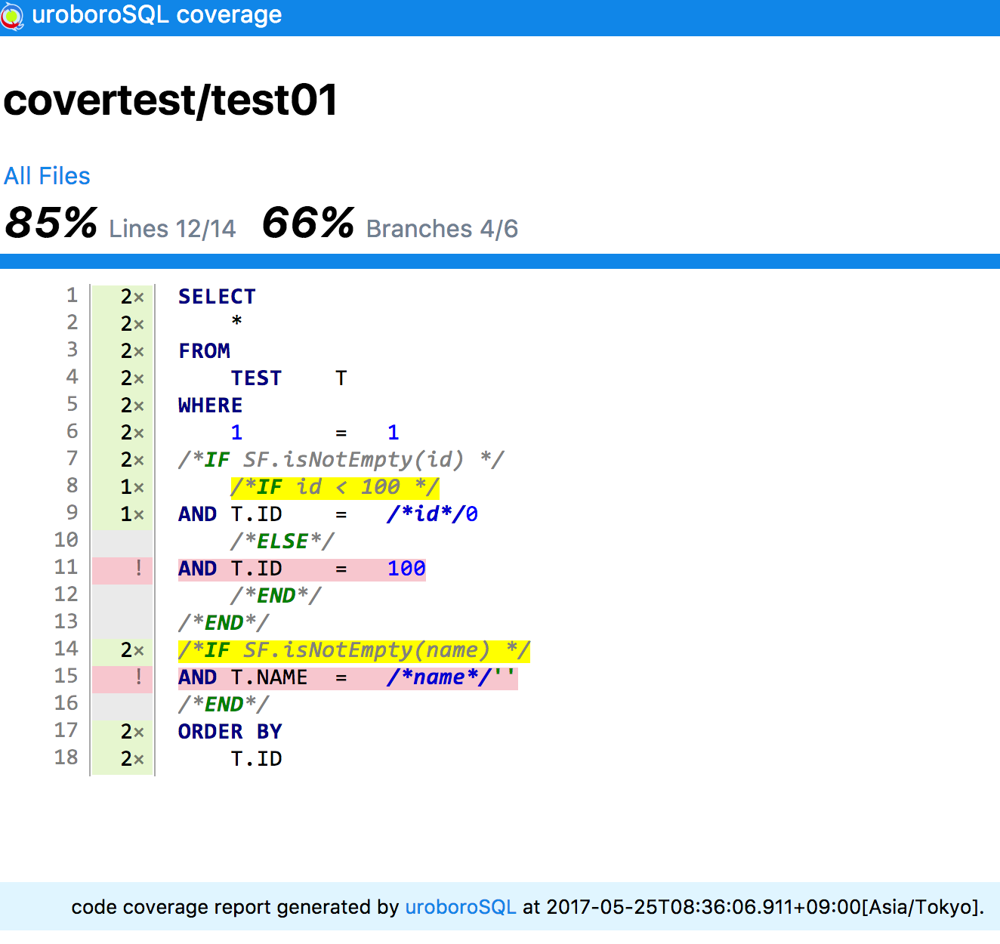

---
meta:
  - name: og:title
    content: '高度な操作'
  - name: og:url
    content: '/uroborosql-doc/advanced/'
---
# 高度な操作

## SQLファイルの解決ルール

### 複数フォルダの指定

sqlフォルダはクラスパスから参照することが出来れば複数指定することが出来ます。

- `src/test/resources`, `src/main/resources` の順にクラスパスに指定されている場合

```md
src
    ├─main
    │   └─resources
    │       └─sql
    │           ├─department
    │           │    ├─insert_department.sql
    │           │    └─select_department.sql
    │           └─employee
    │                ├─insert_employee.sql
    │                └─select_employee.sql
    └─test
        └─resources
            └─sql
                ├─department
                │    ├─update_department.sql
                │    └─delete_department.sql
                └─employee
                     ├─update_employee.sql
                     └─select_employee.sql
```

::: warning
SQLファイルのパスが重複している場合、クラスパス上で先にあるフォルダのSQLファイルが使用されます。  
:::

上記のフォルダ構成の場合、`src/main/resources/sql/employee/select_employee.sql` と `src/test/resources/sql/employee/select_employee.sql` がともに `employee/select_employee` として解決されますが、クラスパスとして`src/test/resources`が先に指定されているため、`src/test/resources/sql/employee/select_employee.sql`が使用されます。

### jarファイルの指定

SQLファイルはjarの中にリソースとして含めることもできます。  
その場合、リソースのルート直下のsqlフォルダをルートフォルダとした相対パスでSQLファイルを指定することができます。
SQLファイルのルートフォルダ（初期値：sql)は変更することができます。  
変更方法の詳細は [SQLファイルルートフォルダの設定](../configuration/sql-manager.md#sqlファイルルートフォルダの設定) を参照してください。

### Dialectによるファイルパスの切り替え

`NioSqlManagerImpl`を`SqlManager`として指定した場合、Dialectによるファイルパスの切り替えが出来るようになります。
詳しくは[DB種類毎のファイルパス切り替え](../configuration/sql-manager.md#db種類毎のファイルパス切り替え)を参照してください。

## PostgreSQLのトランザクション内SQLエラー対応

PostgreSQLでは、１つのトランザクション内でSQLエラーが発生した場合、後続するSQL文はすべて無条件でエラーとなります。
この状態はトランザクションに対して`commit`もしくは`rollback`を実行するまで続きます。

::: warning
エラーが発生している状態で`commit`を実行しても実際には`rollback`されます
:::

これはPostgreSQL固有の動作であり、通常は問題ない動作なのですが、テーブルロックエラーなどリトライ処理を行うケースで問題になります。
（SQLのリトライについては[SQL実行のリトライ](../configuration/sql-agent-factory.md#sql実行のリトライ)を参照）  
**uroboroSQL**ではリトライ指定のあるSQL実行、かつ、PostgreSQL（より正確には`Dialect#isRollbackToSavepointBeforeRetry()`が`true`の場合）の場合にsavepointを使った部分ロールバックを行うことで
この問題に対応しています。  
具体的にはリトライ指定のあるSQL実行、かつ、PostgreSQLの場合はSQL実行の直前にリトライ用のsavepointを設定し、SQL実行が成功すればsavepointの解放、SQL実行が失敗した場合はリトライ用のsavepointまでロールバックを行います。  

::: warning
リトライ指定のないSQL実行の場合はsavepointの設定は行われません。
:::

リトライ指定のないSQLで上記と同様の動作を行う場合は以下のように実装してください。

```java
agent.required(() -> { // トランザクション開始
  try {
    agent.setSavepoint("sp"); // savepointの設定
    agent.update("example/insert_product")
      .param("product_id", 1)
      .count();
    agent.releaseSavepoint("sp"); // savepointの解放
  } catch (UroborosqlSQLException ex) {
    ex.printStackTrace();
    agent.rollback("sp"); // 指定したsavepointまでロールバック
  }
  // 後続処理
  int count = agent.update("department/insert_department")
    .param("dept_no", 1)
    .param("dept_name", "Sales")
    .count();
    ・・・
});
```

## SQLカバレッジ

これまでアプリケーション上の条件分岐はカバレッジツールを利用して網羅率を確認することができました。  
しかし、SQL文の条件分岐は実際にその分岐が通っているかどうかを確認する手段がなく、リリース後に初めて通った条件で不具合を発生させることがありました。  
この問題を解決するために**uroboroSQL**では、SQL文の条件分岐を集計してカバレッジレポートを行う機能を提供します。

SQLカバレッジは**uroboroSQL**を利用するアプリケーションの起動時オプションに

```md
-Duroborosql.sql.coverage=true
```

を追加することで有効になります。  
SQLカバレッジを有効にするとアプリケーションが実行している間に実行されるSQLについて、カバレッジ情報が収集されます。  
カバレッジ情報の収集結果は標準では`target/coverage/sql-cover.xml`に出力されます。  
このファイルの場所や名前を変更したい場合は、起動時オプションに

```md
-Duroborosql.sql.coverage.file=[出力ファイルパス]
```

を指定してください。

出力された`sql-cover.xml`をJenkinsのCobertura pluginなどのXMLレポートとして読み込むとSQLファイルのカバレッジレポートが参照できるようになります。


また<Badge text="0.2.0+" vertical="middle"/>より、**uroboroSQL**のみでHTMLレポートを出力することができるようになりました。  
起動時オプションに

```md
-Duroborosql.sql.coverage=jp.co.future.uroborosql.coverage.reports.html.HtmlReportCoverageHandler
```

を指定することで本機能を利用することができます。

カバレッジ情報はデフォルトでは`target/coverage/sql`フォルダ配下に出力されます。  
出力先フォルダを変更した場合は、起動時オプションに

```md
-Duroborosql.sql.coverage.dir=[出力フォルダパス]
```

を指定してください。

出力されたレポートのサンプルは下記を参照してください。

### サマリーページ



### 詳細ページ



<a :href="$withBase('/sample/testReport/')" target="_blank" style="font-size:20px;"><i class="fa fa-external-link" aria-hidden="true"></i>出力サンプル</a>

## ログ出力

**uroboroSQL**ではログ出力ライブラリとしてSLF4Jを使用しています。SLF4Jの詳細は[公式のドキュメント](https://www.slf4j.org/)を参照して下さい。  
**uroboroSQL**で出力されるログ内容は以下表の通りです。

|クラス名|TRACE|DEBUG|INFO|WARN|ERROR|FATAL|
|:--:|:--:|:--:|:--:|:--:|:--:|:--:|
|AbstractAgent|変換前SQL|実行時SQL|-|-|-|-|
|DebugSqlFilter|-|パラメーター/<br>対象データ数/<br>実行結果|-|-|-|-|
|IfNode|-|評価式/<br>判定結果/<br>パラメーター|-|-|-|-|
|Parameter|-|パラメーターの設定|-|サブパラメーター値にNULLを設定|-|-|
|SecretColumnSqlFilter|-|バッチ処理追加件数/<br>ストアドプロシージャ出力パラメーター|-|-|-|-|
|SqlAgent|ステートメントのクローズ|処理実行アナウンス/<br>リトライ実行アナウンス/<br>SQL実行時間|-|-|エラーメッセージ|-|
|SqlContext|-|バッチ処理追加件数/<br>ストアドプロシージャ出力パラメーター|-|-|-|-|
|SqlContextFactory|-|定数パラメーター|-|定数名の重複|エラーメッセージ|-|
|SqlLoader|SQL定義ファイルの読み込み完了|SQL定義ファイルの読み込み開始/読み込み中|-|-|デフォルトファイルパスの設定/<br>デフォルト拡張子/<br>空のSQLキャッシュの返却|-|

## システムプロパティ

**uroboroSQL**ではシステムプロパティを指定することで動作を変更することができます。

|プロパティ名|説明|初期値|
|:---|:---|:---|
|uroborosql.sql.coverage|SQLカバレッジを出力するかどうかのフラグ。`true`の場合はSQLカバレッジを出力します。<br>文字列として`jp.co.future.uroborosql.coverage.CoverageHandler`インタフェースの<br>実装クラスが設定された場合はそのクラスを利用してカバレッジの収集を行います。|なし|
|uroborosql.sql.coverage.file|指定されたPATH(ファイル)に SQLカバレッジのCobertura形式のxmlレポートを出力します。|./target/coverage/sql-cover.xml|
|uroborosql.sql.coverage.dir|指定されたPATH(フォルダ)にSQLカバレッジのHTMLレポートを出力します。|./target/coverage/sql|
|uroborosql.entity.cache.size|Entityクラス情報のキャッシュサイズを指定します。<br>キャッシュサイズを超えるEntityクラスの読み込みがあった場合は古い情報から破棄されます。|30|
