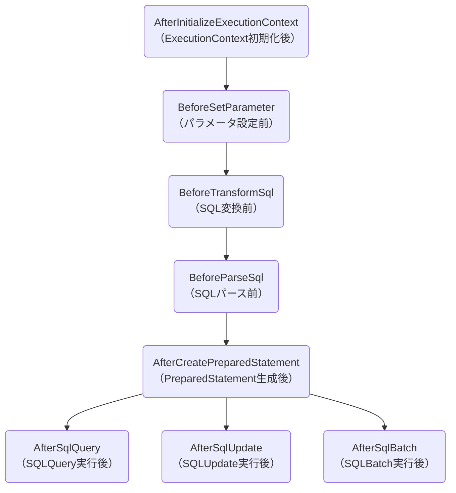
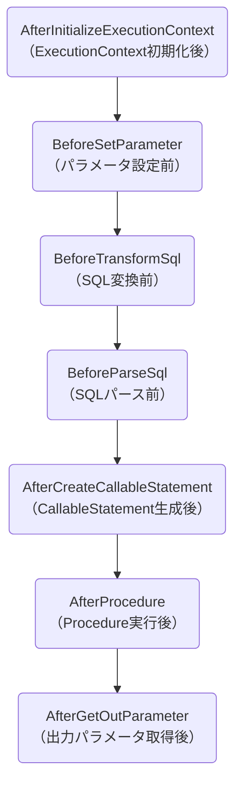

---
head:
  - - meta
    - name: og:title
      content: "EventListenerHolder"
  - - meta
    - name: og:url
      content: "/uroborosql-doc/configuration/event-listener-holder.html"
---

# EventListenerHolder と EventSubscriber

## 概要

**uroboroSQL**では、SQL実行時のイベントをリスニングするための仕組みとして、`EventListenerHolder`と`EventSubscriber`を提供しています。これらを利用することで、SQL実行前後の処理をフックし、ロギングやメトリクス収集などのクロスカッティングな処理を実装できます。

## EventListenerHolder

`EventListenerHolder`は、複数の`EventSubscriber`を管理するコンテナクラスです。SQL実行時のイベントを登録されたすべてのサブスクライバーに通知します。

### 主な機能

- イベントサブスクライバーの登録・削除、イベントサブスクライバー一覧の取得
- 登録されたすべてのサブスクライバーへのイベント通知
- イベント処理の順序制御

## EventSubscriber

`EventSubscriber`は、SQL実行時の各種イベントを受け取るためのインターフェースです。以下のようなイベントをハンドリングできます。

### 対応イベント

#### SQL実行関連

| イベント                            | 説明                     |
| ----------------------------------- | ------------------------ |
| **AfterInitializeExecutionContext** | ExecutionContext初期化後 |
| **BeforeSetParameter**              | パラメータ設定前         |
| **BeforeTransformSql**              | SQL変換前                |
| **BeforeParseSql**                  | SQLパース前              |
| **AfterCreatePreparedStatement**    | PreparedStatement生成後  |
| **AfterCreateCallableStatement**    | CallableStatement生成後  |
| **AfterSqlQuery**                   | SQLQuery実行後           |
| **AfterSqlUpdate**                  | SQLUpdate実行後          |
| **AfterSqlBatch**                   | SQLBatch実行後           |
| **AfterProcedure**                  | Procedure実行後          |
| **AfterGetOutParameter**            | 出力パラメータ取得後     |

- SqlAgent#query/update/batch 実行時イベントの発生順序は以下になります。



- SqlAgent#procedure 実行時イベントの発生順序は以下になります。



#### Entity操作関連

| イベント                    | 説明                    |
| --------------------------- | ----------------------- |
| **BeforeEntityQuery**       | EntityQuery実行前       |
| **AfterEntityQuery**        | EntityQuery実行後       |
| **BeforeEntityInsert**      | EntityInsert実行前      |
| **AfterEntityInsert**       | EntityInsert実行後      |
| **BeforeEntityUpdate**      | EntityUpdate実行前      |
| **AfterEntityUpdate**       | EntityUpdate実行後      |
| **BeforeEntityDelete**      | EntityDelete実行前      |
| **AfterEntityDelete**       | EntityDelete実行後      |
| **BeforeEntityBatchInsert** | EntityBatchInsert実行前 |
| **AfterEntityBatchInsert**  | EntityBatchInsert実行後 |
| **BeforeEntityBatchUpdate** | EntityBatchUpdate実行前 |
| **AfterEntityBatchUpdate**  | EntityBatchUpdate実行後 |
| **BeforeEntityBulkInsert**  | EntityBulkInsert実行前  |
| **AfterEntityBulkInsert**   | EntityBulkInsert実行後  |

#### トランザクション関連

| イベント                  | 説明                   |
| ------------------------- | ---------------------- |
| **AfterBeginTransaction** | トランザクション開始後 |
| **BeforeEndTransaction**  | トランザクション終了前 |
| **BeforeCommit**          | コミット前             |
| **AfterCommit**           | コミット後             |
| **BeforeRollback**        | ロールバック前         |
| **AfterRollback**         | ロールバック後         |

## **uroboroSQL**で提供されているサブスクライバー

**uroboroSQL**では、以下の`EventSubscriber`実装が標準で提供されています。

| サブスクライバ                                                      | 説明                                                    |
| ------------------------------------------------------------------- | ------------------------------------------------------- |
| [**SecretColumnEventSubscriber**](#secretcolumneventsubscriber)     | 指定したカラムの値を自動的に暗号化/復号化します         |
| [**WrapContextEventSubscriber**](#wrapcontexteventsubscriber)       | ExecutionContextをラップして機能を拡張します            |
| [**AuditLogEventSubscriber**](#auditlogeventsubscriber)             | SQL実行の監査ログを出力します                           |
| [**DebugEventSubscriber**](#debugeventsubscriber)                   | SQL実行のデバッグログを出力します                       |
| [**DumpResultEventSubscriber**](#dumpresulteventsubscriber)         | クエリ結果をダンプ形式で出力します                      |
| [**ReplCommandLogEventSubscriber**](#replcommandlogeventsubscriber) | REPL(対話型SQL実行環境)でのコマンド実行ログを出力します |

### SecretColumnEventSubscriber

DBアクセス時に機密カラムの値を暗号化/復号化するサブスクライバーです。  
このサブスクライバーを使用することで、DBの暗号化の仕組みを利用せずにカラム単位での値の暗号化・復号化ができます。

#### **主な機能:**

- [Javaの暗号化の仕組み](https://docs.oracle.com/javase/jp/11/docs/api/java.base/javax/crypto/package-summary.html) を使用して、指定カラムの暗号化・復号化を行います。
  - INSERT/UPDATE実行時に指定カラムの値を暗号化
  - SELECT実行時に指定カラムの値を復号化

#### パラメータ:

| パラメータ名           | 型             | 必須 | デフォルト値         | 説明                                                                                                                                                                                                                                 |
| ---------------------- | -------------- | ---- | -------------------- | ------------------------------------------------------------------------------------------------------------------------------------------------------------------------------------------------------------------------------------ |
| **keyStoreFilePath**   | String         | ○    | -                    | 秘密鍵を格納したKeyStoreファイルのパス<br/>KeyStoreはJCEKSタイプであること                                                                                                                                                           |
| **alias**              | String         | ○    | -                    | KeyStore内で秘密鍵が格納されている場所を示すエイリアス名                                                                                                                                                                             |
| **storePassword**      | String         | ○    | -                    | KeyStoreにアクセスするためのストアパスワード<br/>Base64エンコードした値を指定する                                                                                                                                                    |
| **cryptColumnNames**   | List\<String\> | ○    | -                    | 暗号化、復号化を行うカラム名のリスト<br/>カラム名はスネークケース（大文字）で指定する<br/>cryptColumnNames で指定したカラム名はcryptParamKeysにも追加される                                                                          |
| **cryptParamKeys**     | List\<String\> | ○    | -                    | 暗号化、復号化を行うパラメータ名のリスト<br/>パラメータ名はキャメルケースで指定する                                                                                                                                                  |
| **charset**            | String         |      | UTF-8                | 暗号化/復号化時に使用するキャラクタセット                                                                                                                                                                                            |
| **transformationType** | String         |      | AES/ECB/PKCS5Padding | 変換の名前（例: AES/GCM/NoPadding）。標準の変換名については、[Java暗号化アーキテクチャー標準アルゴリズム名](https://docs.oracle.com/javase/jp/11/docs/specs/security/standard-names.html#cipher-algorithm-names)のドキュメントを参照 |
| **skip**               | boolean        |      | false                | イベント処理をスキップするかどうか                                                                                                                                                                                                   |

::: warning 機密カラムの命名
SecretColumnEventSubscriber では機密情報を格納するカラムをカラム名で特定します。  
そのためカラム名が同一で、暗号化するカラムと暗号化しないカラムが混在している場合は対応できません。  
機密情報を格納するカラムの名前は一意に識別できるような命名を行ってください。
:::

### WrapContextEventSubscriber

発行するSQL文字列の前後をラップするサブスクライバーです。

#### **主な機能:**

- SQL発行をフックし、発行されるSQLの前後に文字列を付与します。主に検索SQLをページングに対応するために一律limit句やoffset句を追加するような用途を想定しています。
- SQL変換前にSQLの加工を行うため、バインドパラメータや置換文字列も利用できます。

#### パラメータ:

| パラメータ名             | 型     | 必須 | デフォルト値 | 説明                                                                                               |
| ------------------------ | ------ | ---- | ------------ | -------------------------------------------------------------------------------------------------- |
| **wrappedSqlBeginParts** | String |      | -            | SQL文の前に追加する文字列<br/>例: `SELECT * FROM (`                                                |
| **wrappedSqlEndParts**   | String |      | -            | SQL文の後に追加する文字列<br/>例: `) LIMIT /*pageSize*/100 OFFSET /*pageSize * (pageCount - 1)*/0` |
| **wrapIgnorePattern**    | String |      | -            | Wrapを無視するSQLのパターン（正規表現）<br/>このパターンにマッチするSQLはWrap処理をスキップする    |

### AuditLogEventSubscriber

SQL実行の監査ログを記録するためのサブスクライバーです。SQL実行前後の情報を構造化されたログとして出力します。  
AuditLogは ログ名 : `jp.co.future.uroborosql.event.auditlog` に debugレベルで出力されます。

#### **主な機能:**

- SQL実行時刻、実行時間の記録
- 実行されたSQL文とバインドパラメータの記録
- 実行結果(件数、エラー情報など)の記録

#### パラメータ:

| パラメータ名    | 型     | 必須 | デフォルト値 | 説明                                                                                      |
| --------------- | ------ | ---- | ------------ | ----------------------------------------------------------------------------------------- |
| **funcIdKey**   | String |      | \_funcId     | バインドパラメータから機能IDを取得する際のキー名<br/>ログに記録する機能IDの取得に使用     |
| **userNameKey** | String |      | \_userName   | バインドパラメータからユーザ名を取得する際のキー名<br/>ログに記録するユーザ名の取得に使用 |

::: warning 注意事項
AuditLogEventSubscriber で件数を取得するためにはResultSetの種類が `ResultSet#TYPE_SCROLL_INSENSITIVE` または `ResultSet#TYPE_SCROLL_SENSITIVE` である必要があります。  
`ResultSet#TYPE_FORWARD_ONLY` の場合は 件数は常に -1 となります。
:::

### DebugEventSubscriber

開発時のデバッグ用ログを出力するサブスクライバーです。SQL実行の詳細な情報をコンソールに出力します。  
デバッグ用ログは ログ名 : `jp.co.future.uroborosql.event.debug` に debugレベルとtraceレベルで出力されます。

#### **主な機能:**

- トランザクション開始・終了の表示（debug）
- バインドパラメータの詳細表示（debug）
- 発行したSQL名の表示（debug）
- 発行したSQL文の表示（trace）

### DumpResultEventSubscriber

クエリ結果をダンプ形式で出力するサブスクライバーです。SELECT文の実行結果を表形式で見やすく表示します。  
クエリ結果ダンプ結果ログは ログ名 : `jp.co.future.uroborosql.event.dumpresult` に debugレベルで出力されます。

#### **主な機能:**

- クエリ結果の表形式表示

::: warning 注意事項
DumpResultEventSubscriber によるクエリ結果の取得にはResultSetの種類が `ResultSet#TYPE_SCROLL_INSENSITIVE` または `ResultSet#TYPE_SCROLL_SENSITIVE` である必要があります。  
`ResultSet#TYPE_FORWARD_ONLY` の場合もクエリ結果は出力されますが、このサブスクライバーが結果セットを先頭から最後まで読み進めるため、
処理後にはカーソルが末尾に到達し、アプリケーション側で同じ `ResultSet` を使った後続の検索・取得処理は行えなくなります（結果セットが消費されます）
:::

### ReplCommandLogEventSubscriber

REPL(対話型SQL実行環境)でのコマンド実行ログを記録するサブスクライバーです。  
コマンド実行ログは ログ名 : `jp.co.future.uroborosql.event.replcommand` に debugレベルで出力されます。

#### **主な機能:**

- REPLコマンドの実行履歴記録

## カスタムEventSubscriberの作成

**uroboroSQL**では、`EventSubscriber`インターフェースを実装することで、独自のイベント処理を追加できます。  
ここでは、カスタムサブスクライバーを作成する方法を解説します。

### 基本的な実装手順

#### 1. EventSubscriberインターフェースの実装

`EventSubscriber`を継承し、必要なイベントメソッドをオーバーライドします。

```java
public class CustomEventSubscriber extends EventSubscriber {
    private static final Logger LOG = LoggerFactory.getLogger(CustomEventSubscriber.class);

    @Override
    public void initialize() {
        // EventSubscriberが提供する各イベントのリスナー登録用メソッドにリスナーを登録
		    afterSqlQueryListener(this::afterSqlQuery);
        // 初期化処理
        LOG.info("CustomEventSubscriber initialized");
    }

    void afterSqlQuery(final AfterSqlQueryEvent evt) {
        LOG.debug("Execute Query - sqlName:{} executed.", evt.getExecutionContext().getSqlName());
    }
}
```

#### 2. SqlConfigへの登録

作成したサブスクライバーを`SqlConfig`に登録します。

```java
SqlConfig config = UroboroSQL.builder("jdbc:h2:mem:test", "sa", "")
    .build();

config.getEventListenerHolder()
    .addEventSubscriber(new CustomEventSubscriber());
```

### EventSubscriber実装例（共通項目自動パラメータバインド）

アプリケーションで使用する各テーブルに共通項目（登録日時、更新日時など）が定義されている場合、
INSERT文やUPDATE文を実行する際には、毎回これらの共通項目に対するパラメータを指定する必要があります。

このような共通項目へのパラメータ設定を個別に行うと、実装が煩雑になるだけでなく、
実装漏れや記述ミスにより正しく値が設定されないといった問題が発生しやすくなります。

このような共通項目へのパラメータ設定は、`EventSubscriber` を利用することで自動化できます。
`EventSubscriber` のイベントはSQL実行のたびに呼び出されるため、イベント内で共通項目のパラメータを設定することで、
すべてのSQL実行時に自動的にパラメータがバインドされます。

- 共通項目自動パラメータバインドイベントサブスクライバー実装例

```java
/**
 * 共通項目自動パラメータバインドイベントサブスクライバー
 **/
public class AutoParameterBindEventSubscriber extends EventSubscriber {
    @Override
    public void initialize() {
      // SQL API 用
      beforeParseSqlListener(this::onBeforeParseSql);

      // DAO API 用
      beforeEntityInsertListener(event -> bindInsertParams(event.getEntity()));
      beforeEntityBulkInsertListener(event -> bindInsertParams(event.getEntity()));
      beforeEntityBatchInsertListener(event -> bindInsertParams(event.getEntity()));
      beforeEntityUpdateListener(event -> bindUpdateParams(event.getEntity()));
      beforeEntityBatchUpdateListener(event -> bindUpdateParams(event.getEntity()));
    }

    /**
     * SQLパース前のイベントを処理する.
     *
     * @param event イベント
     */
    protected void onBeforeParseSql(final BeforeParseSqlEvent event) {
      switch (event.getExecutionContext().getSqlKind()) {
        case INSERT,
             MERGE,
             UPDATE,
             BATCH_INSERT,
             BATCH_UPDATE,
             BULK_INSERT,
             ENTITY_BATCH_INSERT,
             ENTITY_BULK_INSERT,
             ENTITY_INSERT,
             ENTITY_UPDATE -> {
                ExecutionContext ctx = event.getExecutionContext();
                LocalDateTime now = LocalDateTime.now();
                ctx.paramIfAbsent("createDatetime", now);
                ctx.paramIfAbsent("updateDatetime", now);
             };
        default -> {}
      }
    }

    /**
     * 登録用のパラメータをバインドする.
     *
     * @param entity エンティティ
     */
    protected void bindInsertParams(final Object entity) {
        // DAOクラスがEntityModel抽象クラスを継承し、EntityModelクラスに共通項目のフィールドが定義されている、とします。
      if (!(entity instanceof EntityModel model)) {
        return;
      }

      LocalDateTime now = LocalDateTime.now();
      model.setCreateDatetime(now);
      model.setUpdateDatetime(now);
    }

    /**
     * 更新用のパラメータをバインドする.
     *
     * @param entity エンティティ
     */
    protected void bindUpdateParams(final Object entity) {
        // DAOクラスがEntityModel抽象クラスを継承し、EntityModelクラスに共通項目のフィールドが定義されている、とします。
      if (!(entity instanceof EntityModel model)) {
        return;
      }

      model.setUpdateDatetime(LocalDateTime.now());
    }
}
```
