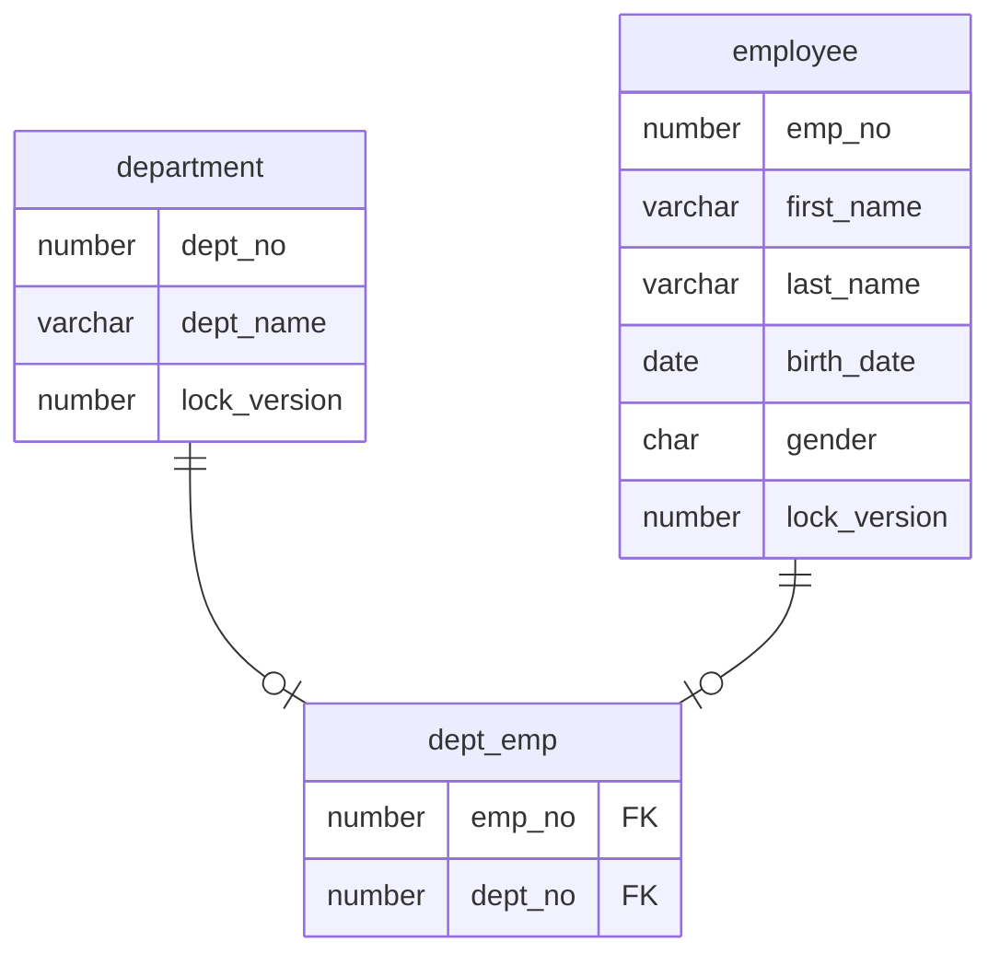

---
head:
  - - meta
    - name: og:title
      content: "SQLファイルを使用したDBアクセス"
  - - meta
    - name: og:url
      content: "/uroborosql-doc/getting_started/sql-file-access.html"
---

# SQLファイルを使用したDBアクセス

## SqlConfigの生成

SQLファイルを使用したサンプルコード [SqlFileApiSample.java](https://github.com/future-architect/uroborosql-sample/blob/master/src/main/java/jp/co/future/uroborosql/sample/SqlFileApiSample.java) を例として説明します。

まず初めにコンストラクタの中で最初に`SqlConfig`クラスを作成しています。
`SqlConfig`は**uroboroSQL**に対する各種の設定を保持するクラスで、`SqlConfig`の設定を変更することで**uroboroSQL**の動作を変更することが出来ます。  
ここでは[H2DB](http://www.h2database.com/html/main.html)のメモリDBに接続する`SqlConfig`インスタンスを生成しています。
`SqlConfig`の生成には`UroboroSQL`クラスによるBuilderAPIを使用します。

- 基本的な呼出方法（DBへの接続情報のみ指定）

```java
// create SqlConfig
SqlConfig config = UroboroSQL.builder("jdbc:h2:mem:test;DB_CLOSE_DELAY=-1", "sa", "").build();
```

- 設定のカスタマイズ（定数の指定や検索結果の取得方法変更）

```java
// create SqlConfig
SqlConfig config = UroboroSQL
    .builder("jdbc:h2:mem:test;DB_CLOSE_DELAY=-1", "sa", "")
    // SqlContextFactoryの設定（Enum定数パッケージ設定の追加）
    .setSqlContextFactory(new SqlContextFactoryImpl()
    .setEnumConstantPackageNames(Arrays.asList(Gender.class.getPackage().getName())))
    // SqlAgentFactoryの設定（Queryの戻り値のMapのキー文字列のデフォルトCaseFormat設定の追加）
    .setSqlAgentFactory(new SqlAgentFactoryImpl().setDefaultMapKeyCaseFormat(CaseFormat.CAMEL_CASE))
    // SqlManagerの設定（NioSqlManagerImplの指定）
    .setSqlManager(new NioSqlManagerImpl(false))
    .build();
```

`SqlConfig`生成時のカスタマイズの詳細については [設定](../configuration/index.md)を参照してください。

## テーブルの作成と初期データの登録

次に事前準備として以降の処理で使用するテーブルの作成と初期データの登録を行います。（`SqlFileApiSample#setupTableAndData()`を参照）  
SQLを実行する場合は`SqlConfig`から`SqlAgent`を生成します。
`SqlAgent`は**uroboroSQL**の中核となるクラスで、**uroboroSQL**の各操作はこの`SqlAgent`を使って行います。  
`SqlAgent`は`AutoClosable`インタフェースを実装しているので、try-with-resources文で囲むことで処理終了時に自動でクローズされます。
このとき`SqlAgent`の中に保持する`Connection`や`Statement`も合わせてクローズされるため、クローズ漏れによるメモリリークを防ぐことができます。

```java
// create SqlAgent. SqlAgent implements AutoClosable.
try (SqlAgent agent = config.agent()) {
  // ここにSQL実行の処理を実装する
}
```

::: tip
以降の説明では`SqlAgent`に対する処理はtry-with-resources文の中で行っているものとします。
:::

**uroboroSQL**では実行するSQLをファイルパスに似た表現（以降 _SQL名_ と呼ぶ）で指定します。
下の例ではクラスパス上にあるsqlフォルダ配下のddl/create_tables.sqlを指定してSQL更新処理を実行します。

更新処理を行う場合、`SqlAgent#update("[SQL名]")`メソッドを使用して**SqlUpdate**を取得しUpdateの実行を行います。

```java
// create table :  テーブル作成
agent.update("ddl/create_tables").count();
// setup data : 初期データ挿入
agent.update("setup/insert_data").count();
```

ddl/create_tables.sqlで作成したテーブルの構成は以下になります。



## SQLファイルを使用した検索

登録したデータを検索します。検索を行う際は、`SqlAgent#query("[SQL名]")`メソッドを使用して**SqlQuery**を取得し、バインドパラメータの設定や検索の実行を行います。

**SqlQuery**では検索結果をいくつかの形式で取得することができます。

| メソッド             | 説明                                                                                                           |
| :------------------- | :------------------------------------------------------------------------------------------------------------- |
| SqlQuery#collect()   | 検索結果を`List<Map>`の形式で取得する                                                                          |
| SqlQuery#stream()    | 検索結果を`java.util.Stream`の形式で取得する                                                                   |
| SqlQuery#resultSet() | 検索結果の`ResultSet`を取得する                                                                                |
| SqlQuery#first()     | 検索結果の１件目を取得する。取得できない場合は`RuntimeException`がスローされる                                 |
| SqlQuery#findFirst() | 検索結果の１件目を取得する。戻り値は`Optional`                                                                 |
| SqlQuery#one()       | 検索結果の１件目を取得する。取得できない場合、もしくは２件以上取得出来た場合は`RuntimeException`がスローされる |
| SqlQuery#findOne()   | 検索結果の１件目を取得する。戻り値は`Optional`。２件以上取得出来た場合は`RuntimeException`がスローされる       |

以下のように呼び出します。

```java
// no parameter : バインドパラメータ指定なしで検索
List<Map<String, Object>> deps1 = agent.query("department/select_department")
    .collect();

// add bind parameter : バインドパラメータを設定して検索
List<Map<String, Object>> deps2 = agent.query("department/select_department")
    .param("deptNo", 1)
    .collect();
```

ここで実行されるSQLは以下のようになっています。

- department/select_department.sql

```sql
select /* _SQL_ID_ */
    dept.dept_no        as    dept_no
,   dept.dept_name      as    dept_name
,   dept.lock_version   as    lock_version
from
    department    dept
/*BEGIN*/
where
/*IF SF.isNotEmpty(deptNo)*/
and dept.dept_no    = /*deptNo*/1
/*END*/
/*IF SF.isNotEmpty(deptName)*/
and dept.dept_name  = /*deptName*/'sample'
/*END*/
/*END*/
```

- `/* _SQL_ID_ */` はSQLを特定するID(SQL_IDといいます)を付与するための予約語で、実行時にSQLファイルを特定するための文字列に変換されます。
- `/*IF*/ ... /*END*/`は条件分岐で、IFの後ろの評価式が`True`となる場合に`/*IF*/`と`/*END*/`で囲まれた部分が出力されます。
- `/*deptNo*/`はバインドパラメータで、実行時に`?`に変換され、SqlQueryに設定したパラメータがSQLへバインドされます。
- `/*deptNo*/`の後ろの`1`はテスト用データです。このようにテスト用データをSQL文に記述しておくことで、このSQLを
  SQLクライアントツールで実行する際にエラーにならずに文法の確認を行うことができます。

SQLで使用できる構文については[2WaySQL](../background/#_2waysql)を参照してください。  
また、検索のより詳しい説明は[SQLによる検索](../basics/sql-file-api.md#sqlによる検索-sqlagent-query-sqlagent-querywith)を参照してください。

## SQLファイルを使用した行挿入

テーブルに対して行挿入を行うことも出来ます。
行挿入を行う際は、`SqlAgent#update("[SQL名]")`メソッドを使用して**SqlUpdate**を取得し、続けてバインドパラメータの設定やSQLの実行を行います。

```sql
agent.update("department/insert_department")
    .param("deptName", "production")
    .count();
```

ここで実行されるSQLは以下のようになっています。

- department/insert_department.sql

```sql
insert /* _SQL_ID_ */
into
    department
(
    dept_name
,   lock_version
) values (
    /*deptName*/'sample'
,   0
)
```

`SqlAgent#update("[SQL名]")`では実行するSQLの内容によって行挿入の他に行更新や行削除を行うことが出来ます。より詳しい説明は[SQLによる更新](../basics/sql-file-api.md#sqlによる更新-sqlagent-update-sqlagent-updatewith)を参照してください。
